# Урок 4

## **SQL – работа с несколькими таблицами**

**Таблицы:
[по ссылке](https://drive.google.com/file/d/1TZzW8ZlDdvIfDC9C46bUeILey6opQjdu/view?usp=share_link)**

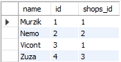

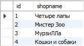

---

### **Используя JOIN-ы, выполните следующие операции**

**Вывести всех котиков по магазинам по id (условие соединения shops.id = cats.shops_id).**

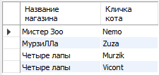

---

**Вывести магазин, в котором продается кот “Murzik” (попробуйте выполнить 2 способами).**

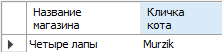

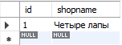

---

**Вывести магазины, в которых НЕ продаются коты “Murzik” и “Zuza”.**

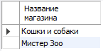

---

**Таблички (после слов “Последнее задание, таблица:”):
[по ссылке](https://drive.google.com/file/d/1TZzW8ZlDdvIfDC9C46bUeILey6opQjdu/view?usp=share_link)**

**Есть таблица анализов Analysis:
an_id — ID анализа;
an_name — название анализа;
an_cost — себестоимость анализа;
an_price — розничная цена анализа;
an_group — группа анализов.**

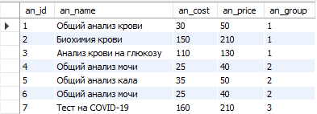

**Есть таблица групп анализов Groupsan:
gr_id — ID группы;
gr_name — название группы;
gr_temp — температурный режим хранения.**

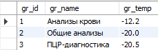

**Есть таблица заказов Orders:
ord_id — ID заказа;
ord_datetime — дата и время заказа;
ord_an — ID анализа.**

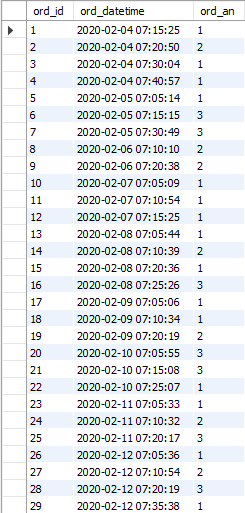

### **Вывести название и цену для всех анализов, которые продавались 5 февраля 2020 и всю следующую неделю**

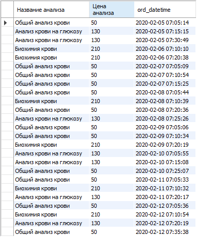

---
---

### ****Доп к БД по соц сети ВК**

**скрипт: [по ссылке](https://www.notion.so/c448e32ae1344f22b1deae7f42c8b57f) в конце**

**Подсчитать общее количество лайков, которые получили пользователи младше 12 лет.**

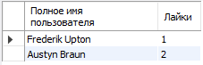

---

**Определить кто больше поставил лайков (всего): мужчины или женщины.**

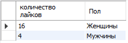

---

**Вывести всех пользователей, которые не отправляли сообщения.**

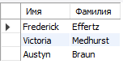

---
[В начало](#урок-4)
